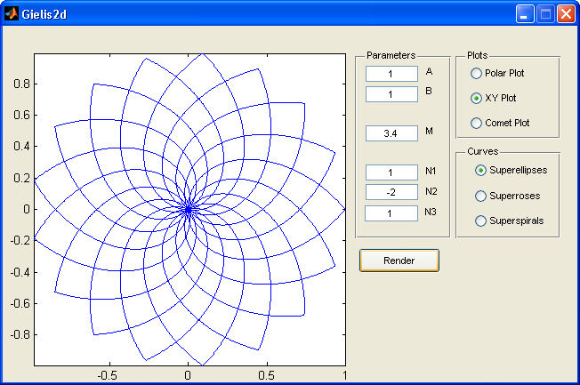

## 📘 Overview
Gielis2d is a GUIDE-based MATLAB GUI for exploring the 2D Gielis superformula, a parametric equation capable of generating a wide variety of natural and abstract shapes. The superformula generalizes the superellipse and can reproduce patterns reminiscent of flowers, stars, shells, and other complex geometries through smooth changes of a small set of parameters.

Reference:
Gielis, J. (2003). A generic geometric transformation that unifies a wide range of natural and abstract shapes. American Journal of Botany, 90(3), 333–338.

## 🖼️ GUI Preview

## ✨ What this GUI does
- Lets you set the six superformula parameters:
  A, B, M, N1, N2, N3 (edit7..edit12)
- Lets you choose the plot type:
  - Polar plot
  - XY plot
  - Comet plot
- Lets you choose the curve family:
  - Superellipse
  - Superroses
  - Superspirals
- Automatically updates the rendering when parameters or options change
- Performs an automatic first render at startup using the default settings in the .fig

## ✅ Defaults and constraints
Default parameter values:
- A = 1
- B = 1
- M = 0
- N1 = 1
- N2 = 1
- N3 = 1

Validation rules:
- A, B, N1 must be real, finite, and non-zero
- M, N2, N3 must be real and finite

Default selections:
- Plot type: Polar plot
- Curve type: Superellipse
- Target axes: axes2

## 📥 Installation
1. Download or clone the repository:
   https://github.com/dnafinder/Gielis2d

2. Add the folder to your MATLAB path:
   addpath('path_to_Gielis2d')

3. Ensure both files are present in the same folder:
   - Gielis2d.m
   - Gielis2d.fig

## ▶️ Usage
Run the GUI by typing:

Gielis2d

Then modify:
- A, B, M, N1, N2, N3 in the parameter boxes
- Plot type using radiobuttons 7–9
- Curve family using radiobuttons 10–12

The rendering should update immediately without requiring a dedicated Render button.

## 🧠 Notes
- The polar rendering uses modern polar plotting while preserving GUIDE layout via an overlay strategy.
- Cartesian plots (XY and Comet) remain anchored to axes2 with axis equal and tight for a clean, consistent view.
- This GUI is intended for exploration and visualization rather than high-precision computational geometry.

## 🧾 Citation
If you use Gielis2d in research, teaching, or publications, please cite:

Cardillo G. (2006). Superformula Generator 2d: a GUI interface to trace a 2d plot of the parametric Gielis Superformula.  
Available at: https://github.com/dnafinder/Gielis2d

## 👤 Author
Giuseppe Cardillo  
Email: giuseppe.cardillo.75@gmail.com  
GitHub: https://github.com/dnafinder

## 📄 License
The code is provided as-is, without any explicit warranty.  
Please refer to the repository for licensing details if a LICENSE file is present.
